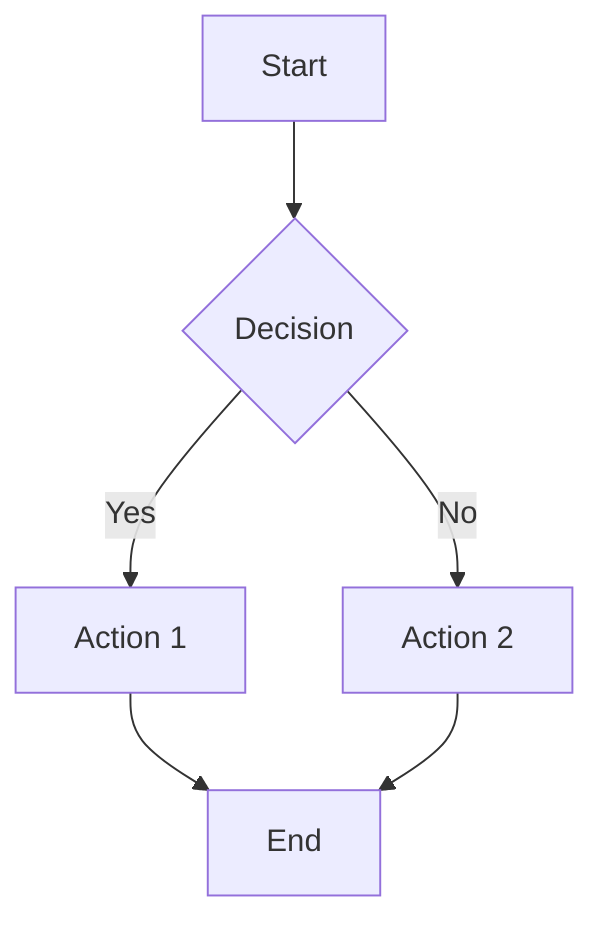

---
aliases:
  - Ideas
  - Key Concepts
tags:
  - concept
---

# Concepts

This note covers key concepts used in the vault.

## Wikilinks

Wikilinks use the `[[target]]` syntax. They can include:

- Display text: `[[target|display]]`
- Heading targets: `[[target#heading]]`
- Block references: `[[target#^block-id]]`

## Backlinks

Backlinks are notes that link to this note. For example, [[Welcome]] links here.

## Tags

Tags can appear in frontmatter or inline with `#tag` syntax.

Inline examples: #concept #knowledge-base

## Properties

Obsidian properties live in YAML frontmatter. Common keys:

- `aliases` — alternative names for the note
- `tags` — categorization
- `cssclasses` — custom CSS classes
- Any custom key-value pairs

See also: [[Projects/Project Alpha]] for a real-world example.

## Callouts

> [!note] About Callouts
> Callouts are a way to highlight important information in your notes.
> They support **markdown** inside them.

> [!tip] Pro Tip
> You can use callouts to draw attention to key ideas.

> [!warning] Be Careful
> This is a warning callout for dangerous operations.

> [!danger] Critical
> Something has gone very wrong.

> [!info]- Collapsed by default
> This content is hidden until expanded.

## Math

Inline math like $E = mc^2$ and $\sum_{i=1}^{n} i = \frac{n(n+1)}{2}$ works with KaTeX.

Display math:

$$
\int_{-\infty}^{\infty} e^{-x^2} dx = \sqrt{\pi}
$$

$$
\mathbf{F} = m\mathbf{a} = m\frac{d\mathbf{v}}{dt}
$$

## Text Formatting

==This text is highlighted== and this is normal. You can also use ~~strikethrough~~ for deleted text.

Combine them: ==highlighted== and ~~struck through~~ in the same paragraph.

## Code

```javascript
function fibonacci(n) {
  if (n <= 1) return n;
  return fibonacci(n - 1) + fibonacci(n - 2);
}
console.log(fibonacci(10)); // 55
```

```python
def quicksort(arr):
    if len(arr) <= 1:
        return arr
    pivot = arr[len(arr) // 2]
    left = [x for x in arr if x < pivot]
    right = [x for x in arr if x > pivot]
    return quicksort(left) + [pivot] + quicksort(right)
```

## External Links

Learn more about [Obsidian](https://obsidian.md) and [Markdown](https://commonmark.org).

## Tables

| Feature | Status | Notes |
| --- | :---: | ---: |
| Wikilinks | Done | `[[target]]` syntax |
| Callouts | Done | All types supported |
| Math | Done | KaTeX inline & display |
| Tables | Done | With alignment |

## Footnotes

This sentence has a footnote[^1] and another one[^note].

[^1]: This is the first footnote definition.
[^note]: Named footnotes work too, with **markdown** inside.

## Images

Embedded image with short name resolution:

![[diagram.png]]

## Note Embeds

Embed another note inline:

![[Welcome]]

## Diagrams



^important-block
